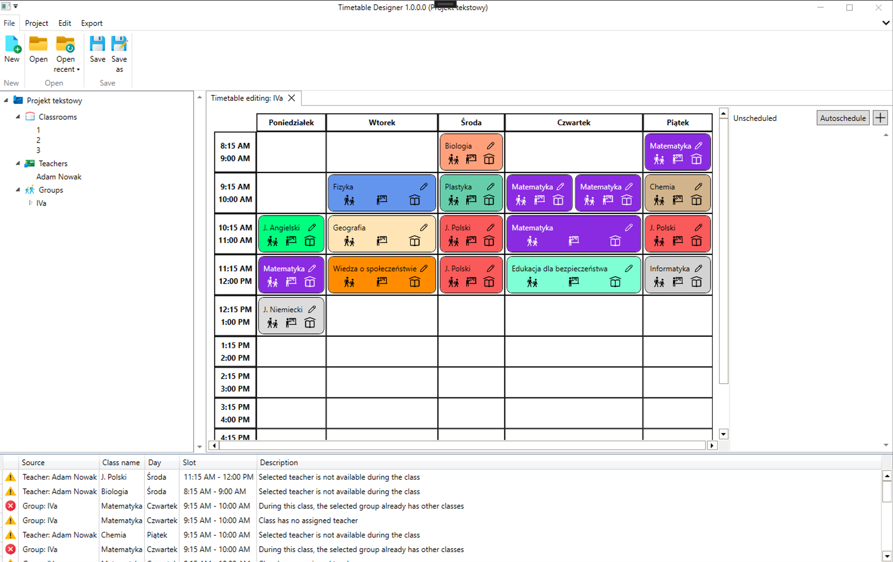

<h1 align="center">Timetable Designer</h1>

<h3 align="center"><b>Advanced school timetable editor, allows you to easily create and manage school timetable.</b></h3>

Timetable Designer was written in C# and WPF framework. App facilitates the creation of school timetables by detecting conflicts between classes at the group, room and teacher levels and by presenting the plan in an accessible form with drag & drop support. This project was part of "Individual Project" course at Warsaw University of Technology.

---

## Informations

> [!NOTE]  
> There is newer version of this app, rewritten as web application. You can check it out <a href="https://repos.mateuszskoczek.com/TimetableDesigner">here</a>. It may be still in development stage.

> [!IMPORTANT]  
> App is no longer maintained, but should work properly.

## Features

- abc

## Installation and usage

abc

## Attribution

You can copy this repository and create your own version of the app freely. However, it would be nice if you included URL to this repository in the description to your repository or in README file.

**Other sources:**

- Icon by <a href="icons8.com">Icons8</a>